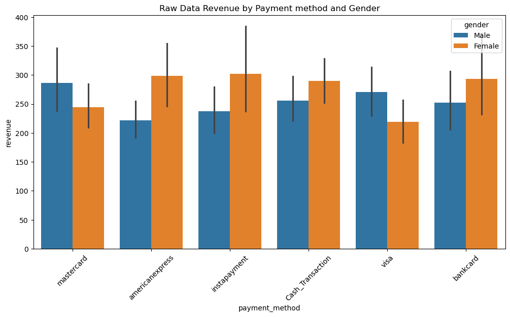
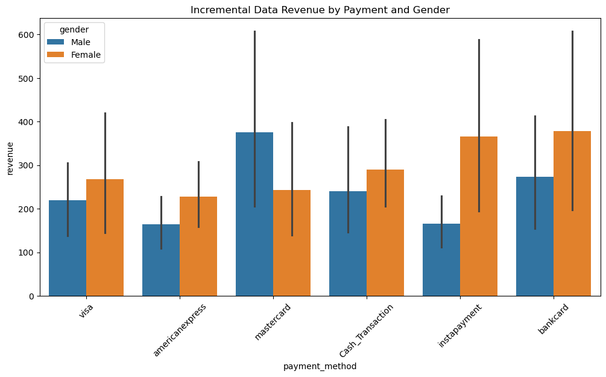

# ETL Exam Project – DSA2040A

## Project Overview
This project demonstrates the **Extract** and **Transform** phases of the ETL (Extract, Transform, Load) process using a dataset generated from **Mockaroo**.  
The objective was to simulate a real-world data warehousing workflow — extracting data from a large dataset, identifying data quality issues, performing meaningful transformations, and preparing it for analytical loading.  

The dataset contains customer transactions with over **8,000 records**, simulating a retail environment with fields such as:
`customer_id`, `product`, `quantity`, `unit_price`, `order_date`, `country`, `payment_method`, and `category`.

All work was done in Jupyter Notebooks using Python and Pandas.

---

## Data Source
**Type:** Synthetic dataset generated via [Mockaroo](https://mockaroo.com/)  
**Files Used:**
- `data/raw_data.csv` – full dataset (~8,000+ rows)  
- `data/incremental_data.csv` – subset of Kenyan transactions from the past 2 years  

The data mimics e-commerce transactions containing customer, product, and financial details.

---

## ET Phases

### 1️⃣ Extract Phase (`etl_extract.ipynb`)
The extraction phase focused on reading, profiling, and validating the datasets.

**Steps Performed:**
1. Loaded both datasets (`raw_data.csv` and `incremental_data.csv`) using Pandas.  
2. Displayed dataset samples using `.head()`, `.info()`, and `.describe()`.  
3. Identified three major data quality issues:
   - Missing values in multiple columns (`payment_method`, `region`, etc.)
   - Inconsistent data types (especially in dates and IDs)
   - Potential duplicates in customer records  
4. Created a filtered subset for **Kenyan transactions within the last 2 years**:
   ```python
   kenya_data = raw_data[
       (raw_data['order_date'] >= start_date) &
       (raw_data['order_date'] <= end_date) &
       (raw_data['country'] == 'Kenya')
   ]
   ```
5. Saved the extracted subset as `data/incremental_data.csv`.

**Outcome:**  
Validated and cleaned raw datasets were prepared and stored in `/data/` for transformation.

---

### 2️⃣ Transform Phase (`etl_transform.ipynb`)
The transformation phase applied multiple cleaning, standardization, and enrichment steps to prepare the data for loading and analysis.

#### 1. Data Cleaning
- Removed rows with missing values in critical columns (`customer_id`, `product`, `category`, `country`).
- Dropped columns with excessive missing values: `region`, `longitude`, `latitude`.
- Filled null values in `payment_method` with `"Cash_Transaction"`.

#### 2. Standardization
- Converted `order_date` to proper datetime format:
  ```python
  raw_data['order_date'] = pd.to_datetime(raw_data['order_date'], format='%m/%d/%Y')
  ```

#### 3. Enrichment
- Added a derived metric:
  ```python
  raw_data['total_cost'] = raw_data['quantity'] * raw_data['unit_price']
  ```
  This column enables revenue analysis and sales segmentation.

#### 4. Filtering
- Filtered transactions to include only relevant countries and recent years.

#### 5. Structural
- Convert columns into relevant data types for better analysis

#### Saved Outputs
- `transformed/transformed_full.csv`
- `transformed/transformed_incremental.csv`

---

## Visualizations

Two bar graphs representing revenue by payment method and gender for each data set






Both charts were created using **Seaborn** and **Matplotlib**, and clearly show that most sales fall into the low-to-medium price bracket, with some categories dominating total revenue.

---

### 🗄️ Load Process
The data was stored using **SQLite**, a lightweight relational database format that ensures portability and easy integration with analytical tools.

**Steps:**
1. Created a database connection:
   ```python
   import sqlite3 as sql
   conn = sql.connect('loaded/full_data.db')
   ```
2. Loaded the transformed CSV files into database tables:
   ```python
   df_full.to_sql('full_data', conn, if_exists='replace', index=False)
   df_incremental.to_sql('incremental_data', conn, if_exists='replace', index=False)
   ```
3. Committed changes and saved the `.db` file in the `/loaded/` folder.

**Tables Created:**
- `full_data` – Complete transformed dataset  
- `incremental_data` – Recent transactions subset

---

### 🔍 Verification

To verify that data was successfully loaded and retained its structure, several SQL queries were executed:

```python
print(pd.read_sql('SELECT * FROM full_data LIMIT 10', conn))
print(pd.read_sql('SELECT COUNT(*) FROM full_data', conn))
print(pd.read_sql('PRAGMA table_info(full_data)', conn))
```

✅ **Verification Outputs:**
- Top 10 rows from both tables displayed successfully  
- Record counts matched CSV file lengths  
- `PRAGMA` checks confirmed correct data types and column names  

### 🧾 Verification Output
```text
Full data columns and types:
   cid      name   type  notnull  dflt_value   pk
0    0   country   TEXT        0        None   0
1    1  category   TEXT        0        None   0
2    2   revenue   REAL        0        None   0

Full data record count: 2823

Incremental data columns and types:
   cid            name   type  notnull  dflt_value   pk
0    0  payment_method   TEXT        0        None   0
1    1        category   TEXT        0        None   0
2    2         revenue   REAL        0        None   0

Incremental data record count: 362
```
---

### ⚠️ Issues Faced & Resolutions
| Issue | Cause | Resolution |
|-------|--------|-------------|
| `OperationalError: table already exists` | Tables were pre-existing from earlier runs | Used `if_exists='replace'` in `to_sql()` to overwrite safely |
| Path errors in early testing | Relative paths not matching Jupyter’s working directory | Verified and fixed using consistent `/transformed/` and `/loaded/` paths |

---

**Result:**  
The ETL pipeline now ends with a fully populated SQLite database containing clean, validated, and query-ready data.

---

## Tools Used
- **Python 3**
- **Jupyter Notebook**
- **Pandas** – data manipulation
- **NumPy** – numerical operations
- **Seaborn & Matplotlib** – data visualization
- **Mockaroo** – dataset generation

---

## Steps to Run the Project
1. Clone or download the repository:
   ```bash
   git clone https://github.com/Mponzi17/DSA2040A_ET_Exam_Mponzi
   cd DSA2040A_ET_Exam_Mponzi
   ```
2. Open the notebooks in Jupyter:
   ```bash
   jupyter notebook etl_extract.ipynb
   jupyter notebook etl_transform.ipynb
   ```
3. Run all cells sequentially (Kernel → Restart & Run All).  
   The final transformed files and charts will be automatically saved in the respective folders.

---

## Sample Outputs
- `data/raw_data.csv` → Original dataset (~8,000 rows)  
- `data/incremental_data.csv` → Filtered subset (Kenya, past 2 years)  
- `transformed/transformed_full.csv` → Cleaned & enriched dataset  
- `transformed/transformed_incremental.csv` → Incremental transformed subset  

---

## ✅ Conclusion
This project successfully demonstrates the ETL process using a realistically structured dataset.  
It covers data extraction, profiling, cleaning, transformation, enrichment, and visualization — ready for analytical use or loading into a data warehouse.

---

**Author:** James Mponzi 
**Course:** DSA2040A – Data Warehousing & Mining  
**Instructor:** Mr. Austin Odera  
**Institution:** USIU
